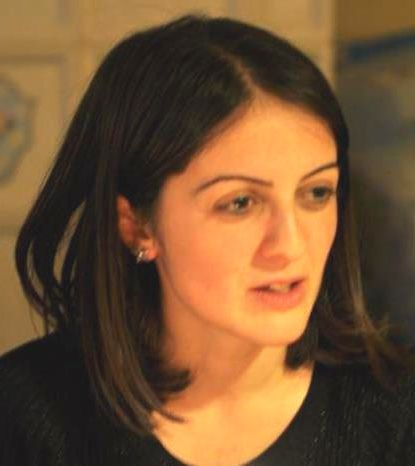
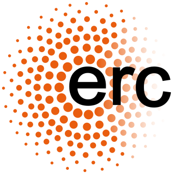

	

		
		

		<b>Begüm Demir</b>  
		Professor and Head of the <a href="https://rsim.berlin" target="_blank">Remote Sensing Image Analysis (RSiM) Group</a>  
		Technische Universität Berlin 
		Faculty of Electrical Engineering and Computer Science 
		EN 627, Einsteinufer 17, 10587, Berlin, Germany
		 
		E-mail: demir [at] tu-berlin.de
		 
		Tel:+49 (0) 30 3142 3771
		

	

	

		

			
			
	        
	        
		

	

	<!-- News Widget -->
	

    	<h5 class="card-header b-0">Latest News (Selected)</h5>
		<!-- List Group -->
		<ul class="list-group list-group-flush" style="font-size: 14px">
			<li class="list-group-item text-justify">
			<b>November 2021</b> - I was one of the speakers at "<a href="https://berlinscienceweek.com/event/the-transformative-effect-of-science-a-joint-event-of-the-berlin-university-alliance-and-the-european-research-council/" target="_blank">The Transformative Effect of Science - A Joint Event of the Berlin University Alliance and the European Research Council</a>", organized in the "<a href="https://berlinscienceweek.com/" target="_blank">Berlin Science Week</a>".
			</li>
			<b>October 2021</b> - I gave a talk at ESA Φ-Week at the key session 'AI4EO Learning from Earth Observation Data to Understand Our Planet'. Details are at <a href="https://incubed.phi.esa.int/%cf%86-week-2021-artificial-intelligence-and-quantum-computing/" target="_blank">https://incubed.phi.esa.int/%cf%86-week-2021-artificial-intelligence-and-quantum-computing/</a>.
			</li>
			<li class="list-group-item text-justify">
				<b>September 2021</b> - Since TU Berlin was the target of an IT attack, we have not been able to update our group webpage. To timely inform our students and colleagues for our research outputs and courses, we have a new webpage now. From now on, please follow us at <a href="https://rsim.berlin" target="_blank">rsim.berlin</a>.
			</li>
			<li class="list-group-item text-justify">
				<b>August 2021</b> - Our Agora-EO vision has been mentioned in the <a href="{{base}}/assets/docs/news/Tagesspiegel_Beilage_Juli2021_Klimaforschung.pdf" target="_blank">Tagesspiegel supplement on Climate Research</a>.
			</li>
			<li class="list-group-item text-justify">
				<b>July 2021</b> - I will be the  keynote speaker at the <a href="https://sites.google.com/view/maclean21/keynotes" target="_blank">MACLEAN workshop @ECML-PKDD 2021</a>.
			</li>
			<li class="list-group-item text-justify">
				<b>June 2021</b> - I'm one of the PIs of the recently established TU Berlin-Huawei  Wireless Joint Innovation Center. We will investigate the use of EO data in the framework of wireless communication.
			</li>
			<li class="list-group-item text-justify">
				<b>May 2021</b> - I will give an invited talk to the Copernicus <a href="https://www.copernicus.eu/en/opportunities/public-authorities/copernicus-relays" target="_blank">Relays</a> and <a href="https://www.copernicus.eu/en/opportunities/education/copernicus-academy" target="_blank">Academy</a> Networks on "Copernicus and Artificial Intelligence: State-of-the-Art Technology and Scientific Research".
			</li>
			<li class="list-group-item text-justify">
				<b>April 2021</b> - Together with the DIMA group of TU Berlin, we have developed a new vision for boosting Earth observation data literacy: <a href="https://www.user.tu-berlin.de/tzirita/publications/BDFS2021_AgoraEO_Paper_Preprint.pdf" target="_blank">Agora-EO: A Unified Ecosystem for Earth Observation</a>.
			</li>
			<li class="list-group-item text-justify">
				<b>January 2021</b> - We have enriched <a href="http://bigearth.net" target="_blank">BigEarthNet</a> with Sentinel 1 images to support research on multi-modal/cross-modal image analysis for Earth observation.
			</li>
			<li class="list-group-item text-justify">
				<b>December 2020</b> -
				We have made public the outputs of our initial research to reduce the negative impact of noisy land-use and land-cover annotations for Earth observation here: <a href="https://noisy-labels-in-rs.org" target="_blank">noisy-labels-in-rs.org</a>.
			</li>
			<li class="list-group-item text-justify">
				<b>November 2020</b> - I'm one of the program committee members of <a href="https://www.bigdatafromspace2021.org" target="_blank">Big Data from Space 2021</a> Conference co-organised by the <a href="https://www.esa.int" target="_blank">European Space Agency (ESA)</a>, the Joint Research Centre (JRC) of the European Commission, and the European Union Satellite Centre (SatCen).
			</li>
			<li class="list-group-item text-justify">
				<b>October 2020</b> - I will be an Invited Speaker at the <a href="https://www.ecmwf.int/en/learning/workshops/ecmwf-esa-workshop-machine-learning-earth-system-observation-and-prediction" target="_blank">ECMWF-ESA Workshop on Machine Learning for Earth System Observation and Prediction</a>.
			</li>
			<li class="list-group-item text-justify">
				<b>September 2020</b> - The codes developed and maintained at <a href="https://rsim.berlin/" target="_blank">RSiM</a> are publicly available <a href="https://rsim.berlin/software" target="_blank">here</a>.
			</li>
			<li class="list-group-item text-justify">
				<b>August 2020</b> - I am one of the lecturers of the summer school on "Machine Learning in Geosciences" organized by <a href="https://www.gfz-potsdam.de/startseite/" target="_blank">GFZ Potsdam</a>. The topic of the lecture is "Introduction to machine learning in geosciences - background and perspectives".
			</li>
			<li class="list-group-item text-justify">
				<b>June 2020</b> - I’m one of the Principle Investigators of a new project 'TreeSatAI-Künstliche Intelligenz mit Erdbeobachtungs- und Multi-Source Geodaten für das Infrastruktur-, Naturschutz- und Waldmonitoring', which is funded by the <a href="https://www.bmbf.de/en/index.html" target="_blank">Federal Ministry of Education and Research</a> for the period 2020-2022.
			</li>
			<li class="list-group-item text-justify">
				<b>March 2020</b> - I'm one of the Principle Investigators of the <a href="https://bifold.berlin" target="_blank">BIFOLD (Berlin Institute for the Foundations of Learning and Data)</a> directed by Prof. Dr. Volker Markl and Prof. Dr. Klaus-Robert Müller.
			</li>
			<li class="list-group-item text-justify">
				<b>February 2020</b> - I will be an Invited Speaker at the <a href="https://www.bgr.bund.de/EN/Themen/Geodatenmanagement/Aktuelles/2019_11_19_big-data-machine-learning-conf_en.html">Conference on Big Data and Machine Learning in Geosciences</a> organized by the Federal Institute for Geosciences and Natural Resources with the support of the German Federal Ministry of Economic Affairs and Energy. The talk will be on <a href="https://www.youtube.com/watch?list=PLn2cxyDRC0H1SA6bsHRuupRy9Lez5mOYr&time_continue=1&v=uZeWIKBZZw4&feature=emb_logo" target="_blank">"Deep Earth Query: Information Discovery from Big Earth Observation Data Archives"</a>.
			</li>
			<li class="list-group-item text-justify">
				<b>January 2020</b> - We made public an alternative class-nomenclature to allow DL models for better describing the complex information content of Sentinel-2 images in BigEarthNet! For details, please visit this <a href="https://git.tu-berlin.de/rsim/bigearthnet-19-models" target="_blank">link</a>.
			</li>
			<li class="list-group-item text-justify">
				<b>December 2019</b> - We have open PhD positions in Deep Learning for Satellite Image Analysis! For details, please visit this <a href="https://rsim.berlin/open_positions" target="_blank">link</a>.
			</li>
			<li class="list-group-item text-justify">
				<b>September 2019</b> - I will be a Keynote Speaker at: 1) <a href="https://phiweek.esa.int" target="_blank">the Φ-week</a> organized by the European Space Agency (ESA) in Frascati, Italy; and 2) the <a href="http://www.gi4dm2019.org" target="_blank">Conference on GeoInformation for Disaster Management</a> in Prague, Czech Republic. Both talks will be on " Machine Learning for Information Discovery from Big Earth Observation Data Archives".
			</li>
			<li class="list-group-item text-justify">
				<b>July 2019</b> - I’m a Principle Investigator of a new project 'IDEAL-VGI - Information Discovery from Big Earth Observation Data Archives by Learning from Volunteered Geographic Information', which is funded by the <a href="https://www.dfg.de/en/" target="_blank">German Research Foundation</a> for the period 2019-2022.
			</li>
			<li class="list-group-item text-justify">
				<b>June 2019</b> - I'm an Invited Lecturer at the <a href="https://gr4s2019.org/" target="_blank">2019 Geoscience and Remote Sensing Summer School</a> organized by IEEE  Geoscience and Remote Sensing Society in Yokohama, Japan, in July 2019.
			</li>
			<li class="list-group-item text-justify">
				<b>June 2019</b> - I will be an Invited Speaker at <a href="https://www.cosmostat.org/events/workshop-on-computational-intelligence-in-remote-sensing-and-astrophysics" target="_blank">the Workshop on Computational Intelligence in Remote Sensing and Astrophysics</a>, Crete, Greece, July 2019. The talk will be on "Scalable Processing of Big Data in Earth Observation".
			</li>
			<li class="list-group-item text-justify">
				<b>May 2019</b> - I'm a Guest Editor of the special issue on "Recent Advances in Geoscience and Remote Sensing: Technologies, Standards and Applications" of the IEEE Geoscience and Remote Sensing Letters.
			</li>
			<li class="list-group-item text-justify">
				<b>March 2019</b> - I'm a Guest Editor of the two special issues within the MPDI Remote Sensing journal, which are "<a href="https://www.mdpi.com/journal/remotesensing/special_issues/Data_Mining_Hyperspectral" target="_blank">Deep Learning and Data Mining for Hyperspectral Imagery</a>" and "<a href="https://www.mdpi.com/journal/remotesensing/special_issues/BigData_UrbanMapping" target="_blank">Big Data in Remote Sensing for Urban Mapping</a>".
			</li>
			<li class="list-group-item text-justify">
				<b>November 2018</b> - I have been appointed as an Associate Editor for the <a href="http://www.grss-ieee.org/publication-category/grsl/" target="_blank">IEEE Geoscience and Remote Sensing Letters</a>.
			</li>
			<li class="list-group-item text-justify">
				<b>July 2018</b> - I'm the recipient of the prestigious <b>"2018 Early Career Award"</b> presented by the IEEE Geoscience and Remote Sensing Society (GRSS).
			</li>
			<li class="list-group-item text-justify">
			<b>February 2018</b> -<!--<a href="http://bigearth.eu" target="_blank">BigEarth</a> and--> I will start at the <a href="http://www.eecs.tu-berlin.de/menue/faculty_iv_electrical_engineering_and_computer_science/parameter/de/?no_cache=1" target="_blank">Faculty of Electrical Engineering and Computer Science</a>, <a href="https://www.tu-berlin.de" target="_blank">Technische Universität Berlin</a>, Germany	in April 1st!
			</li>
		    <li class="list-group-item text-justify">
			<b>December 2017</b> - I close 2017 by being promoted to be an Associate Professor at University of Trento!
			</li>
		    <li class="list-group-item text-justify">
			<b>October 2017</b> - BigEarth was introduced to all local press in Trento with our Rector. (See <a href="http://webmagazine.unitn.it/en/news/ateneo/28371/unitrento-received-305-million-erc-funding-for-24-research-projects-over-10-years" target="_blank">press release</a>)
			</li>
		    	<li class="list-group-item text-justify">
			<b>September 2017</b> - BigEarth is on <a href="http://www.pressreader.com/italy/corriere-del-trentino/20170916/281487866520040" target="_blank">Corriere del Trentino</a> and on <a href="http://www.buyukkocaeli.com.tr/tarih-seni-yazacak-begum-hoca-11692h.htm" target="_blank">local Turkish newspaper</a>.
			</li>
			<li class="list-group-item text-justify">
			<b>September 2017</b> - I got an <a href="https://erc.europa.eu" target="_blank">European Research Council (ERC)</a> <a href="https://erc.europa.eu/sites/default/files/document/file/erc_2017_stg_results_pe.pdf" target="_blank">Starting Grant</a> with my project: BigEarth - Accurate and Scalable Processing of Big Data in Earth Observation.  Welcome home <a href="http://www.bigearth.eu" target="_blank">BigEarth</a>!
			</li>
			<li class="list-group-item text-justify">
			<b>August 2017</b> - I got the accreditation ("<a href="http://abilitazione.miur.it/public/index.php" target="_blank">abilitazione</a>") for Associate Professor in Telecommunications in the national competition in Italy.
			</li>
		</ul>
    

<!-- 

	<b>Short Bio</b> 
	My main research interests include image processing and machine learning with applications to remote sensing image analysis.
	From 2013 to 2018, I was a Professor at <a href="http://disi.unitn.it" target="_blank">The Department of Information Engineering and Computer Science</a>, University of Trento, Italy and a member of <a href="http://disi.unitn.it/rslab/index.php" target="_blank">Remote Sensing Laboratory (RSLab)</a> at the same university from 2010 to 2018. I received the B.S. degree in 2005, the M.Sc. degree in 2007, and the Ph.D. degree in 2010, all in Electronic and Telecommunication Engineering from <a href="http://www.kocaeli.edu.tr/int/">Kocaeli University</a>, Turkey. I'm a senior member of IEEE since 2016.
	

-->
<!--

	

        
    

    

    	
    

    

    	
    

-->
