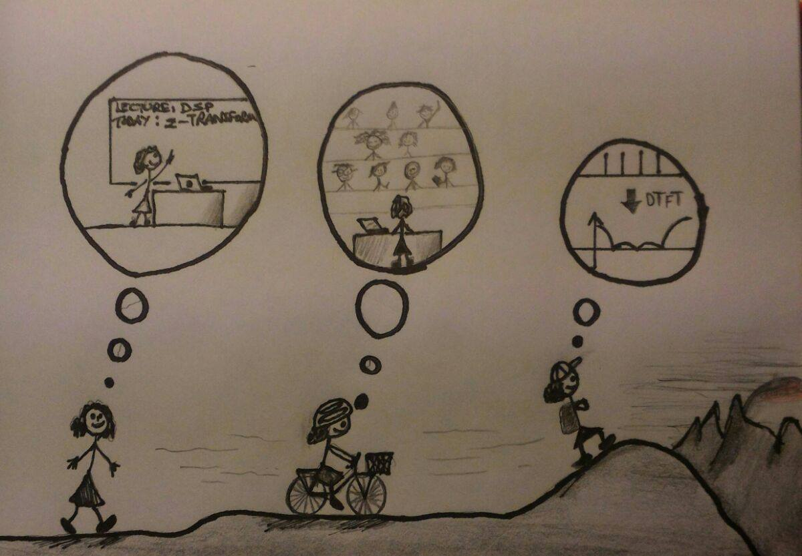

  <b>Digital Signal Processing</b>

  

    
  

  

    <ul class="teaching">
      <li><a title="Digital Signal Processing" href="http://rslab-tech.disi.unitn.it/moodle/course/view.php?id=11" target="_blank">Fall 2016</a></li>
      <li><a title="Digital Signal Processing" href="http://rslab-tech.disi.unitn.it/moodle/course/view.php?id=8" target="_blank">Fall 2015</a></li>
      <li><a title="Digital Signal Processing" href="http://rslab-tech.disi.unitn.it/moodle/course/view.php?id=3" target="_blank">Fall 2014</a></li>
      <li><b>Fall 2013</b></li>
    </ul>
  

   

  <b>Remote Sensing Systems</b>

  

    <ul class="teaching">
      <li><a title="Digital Signal Processing" href="http://rslab-tech.disi.unitn.it/moodle/course/view.php?id=10" target="_blank">Spring 2016</a></li>
      <li><a title="Digital Signal Processing" href="http://rslab-tech.disi.unitn.it/moodle/course/view.php?id=6" target="_blank">Spring 2015</a></li>
    </ul>
  

   

  <b>Pattern Recognition</b> (Fall 2013, together with Prof. Jon Atli Benediktsson)

  <b>Advanced Remote Sensing Systems for Environment</b> (Fall 2013, together with Prof. Lorenzo Bruzzone and Prof. Marcello Coradini)

